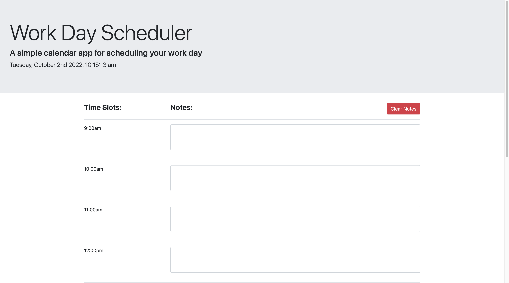

<h1 align = "center">Daily Planner Web App</h1>

<h2>Description:</h2>
The daily planner is used to make quick notes for designated timeslots throughout the day.

<h2>Features:</h2>
<ul>
    <li>Functioning clock that updates in real time</li>
    <li>8 individual slots for work day notes</li>
    <li>Button to save all notes for the next time that the site is visited</li>
    <li>An option to clear all notes when your day is done</li>
</ul>

<a href = "https://github.com/julianbenchimol/Module5-DailyPlanner"><h4>Link to the repo</h4>

<a href = "https://julianbenchimol.github.io/Module5-DailyPlanner/"><h4>Link to the live site</h4></a>

<h2>Screenshot:</h2>

<h2>The Author</h2>

<b>Julian Benchimol</b>

<a href = "https://github.com/julianbenchimol">Git Hub Profile</a>
 
<a href = "jbenchimol1000@gmail.com">My Email</a>
 
